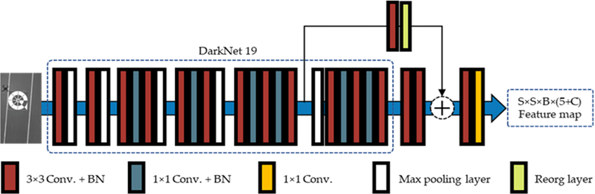
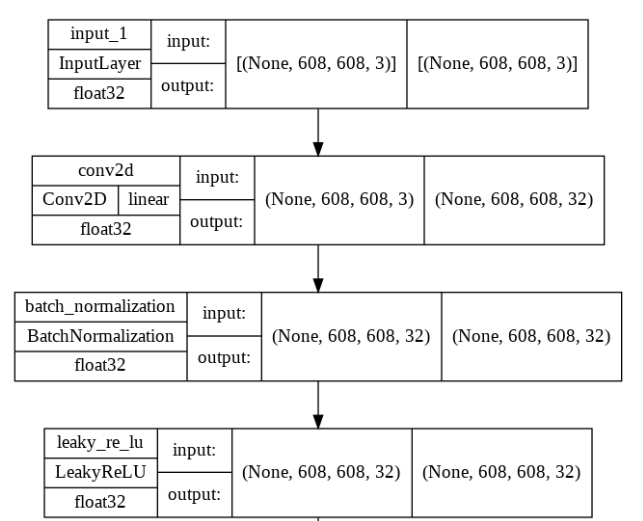
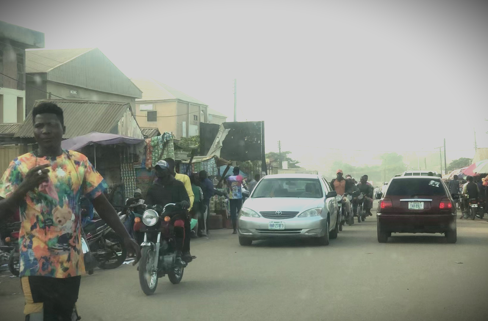
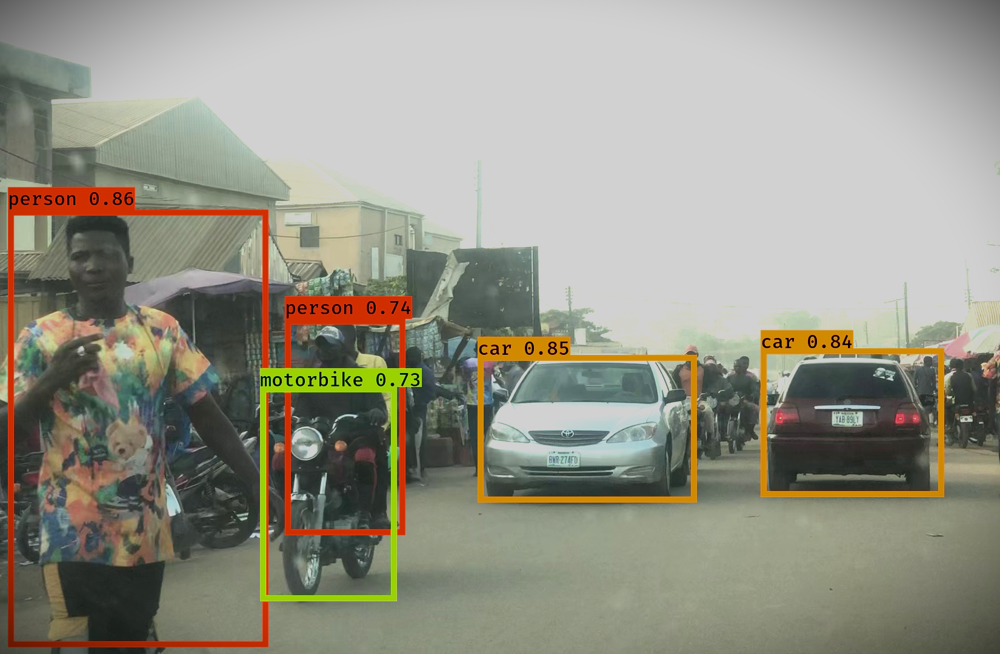

# Driving-Environment-Detector

This program recognizes everyday road objects on a road scene. It is based on the You Only Look Once CNN Architecture, specifically the YOLO v2 Darknet 19. 

# Model Architecture Plot

[Click to view full architecture](images/yolo_model_architecture.png)

# Built Using

- [Python](https://www.python.org)
- [Tensorflow](https://www.tensorflow.org)
- [OpenCV](https://opencv.org/)
- Others

# Prerequisites and Installation

<ul>
    
 <li> <a href = 'https://www.python.org'> Python </a> </li>
        
    python driving_environment_detector.py
        

</ul>

# Usage

> Simply place your video covering a road scene in the top directory. Run the installation code, sip
some coffee or take a walk depending on the legth of your video :). When completed, the new video 
can be found in out/output_video.mp4

# Demo

Sample Input               |  Sample Output
:-------------------------:|:-------------------------:
 |  

# References

- [SlimDeblurGAN-Based Motion Deblurring and Marker Detection for Autonomous Drone Landing - Scientific Figure on ResearchGate.](https://www.researchgate.net/figure/YOLOv2-backbone-convolutional-neural-networks-CNN-architecture-The-backbone-network-is_fig3_342941568)
- [Convolutional Neural Netwokrs](https://www.coursera.org/learn/convolutional-neural-networks/home/)

# Contact

Dahir Ibrahim (Deedax Inc) - http://instagram.com/deedax_inc Email - suhayrid6@gmail.com 
Project Link - https://github.com/Daheer/Driving-Environment-Detector